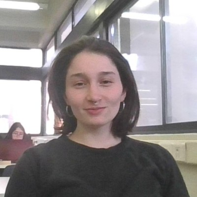

::: {.hero-course .hero-motion-on}

Magíster en Métodos para la Investigación Social · 2 créditos · Universidad Diego Portales 2026

<h1 class="display-4 fw-semibold">Procesamiento y Visualización de datos en R</h1>

Curso práctico de introducción al lenguaje R para el procesamiento, análisis descriptivo y visualización de datos sociales cuantitativos.

<a href="curso.html" class="btn btn-primary btn-md">Ver curso</a>
<a href="clases\clase_00\index.html" class="btn btn-outline-secondary btn-md">Ver clases</a>
<a href="ayudantias.html" class="btn btn-outline-secondary btn-md">Ver ayudantías</a>

:::

<h2 class="team-heading mt-0 mb-2">Equipo:</h2>

Daniela Olivares Collío

Docente

<strong>Correo:</strong> <a href="mailto:daniela.olivares2@mail.udp.cl">daniela.olivares2@mail.udp.cl</a>

Magíster en Estadística de la Pontificia Universidad Católica de Chile (2022).
Licenciada en Sociología de la Universidad de Chile (2019).

Asistente de investigación del proyecto “Clases sociales, movimientos sindicales
y conflicto en tiempos de crisis: un estudio comparativo de Argentina y Chile, CONCLAT”
(Fondecyt Regular N°1230056). Anteriormente, fue coordinadora técnica del Estudio
Longitudinal Social de Chile (ELSOC) del Centro de Estudios del Conflicto y la Cohesión
Social (COES), y asistente metodológica en diversas investigaciones.

Katherine Aravena Herrera

Ayudante

<strong>Correo:</strong> <a href="mailto:katherine.aravena@ug.uchile.cl">katherine.aravena@ug.uchile.cl</a>

Licenciada en Sociología y estudiante del Magíster en Psicología Educacional de la Universidad de Chile.

Asistente de investigación en ERCE 2025 UNESCO del Instituto de Estudios Avanzados en Educación (IE) y en C22 Ciencias Sociales Digitales del Centro de Estudios Públicos (CEP). Ha colaborado en proyectos como LISA-COES, SODAS, FONDEF IT24I0115, entre otros. Maneja R, Python, Quarto/R Markdown, Git/GitHub y Visual Studio Code aplicados al análisis, visualización y trazabilidad de datos.

::: {.course-right}

Noticias

::: {#ultimas-home .latest-listing .latest-compact}
:::

<a href="ultima-informacion.html" class="latest-footer">Ver todas las actualizaciones</a>

:::

