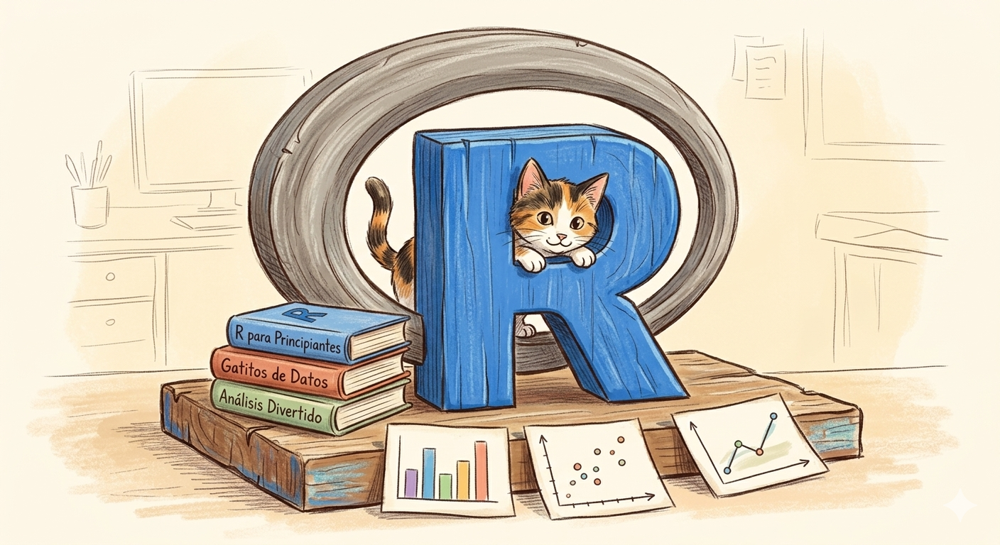

```{=html}
<style>
/* Oculta el encabezado automático de Quarto en este post */
#title-block-header,
.quarto-title-block,
.quarto-title,
.quarto-title-meta,
.quarto-title-meta-heading,
.quarto-title-meta-contents,
.quarto-categories,
.quarto-category,
.description {
  display: none !important;
}

/* Quita el espacio que deja el bloque automático */
#quarto-content,
main.content,
.page-layout-full main {
  padding-top: 0 !important;
  margin-top: 0 !important;
}
</style>
```

::: {.notice-post}

::: {.notice-hero}

<div class="notice-image-wrap">

</div>

::: {.notice-meta}
<span>Bienvenida</span>
<span>Aviso</span>
<span>30 de abril de 2026</span>
:::

# Inicio del curso

<p class="notice-lead">
Bienvenidas y bienvenidos al curso Procesamiento y Visualización de Datos en R. 
Este sitio reunirá la información principal del curso, los materiales de clase, recursos de apoyo y avisos importantes durante el módulo.
</p>

:::

::: {.notice-body}

## Nota de bienvenida

Hola a todas y todos,

Les damos la bienvenida al curso. Durante estas sesiones trabajaremos con **R**, procesamiento de datos, estadística descriptiva y visualización, siempre con un enfoque práctico y aplicado a datos sociales.

La idea de esta página es que puedan tener todo ordenado en un solo lugar. En la sección **Información** encontrarán el programa, las evaluaciones y la calendarización. En **Clases** se irán subiendo las presentaciones y materiales de cada sesión. En **Recursos** encontrarán apoyo para instalar R, usar RStudio, trabajar con Quarto, revisar guías y consultar materiales complementarios.

También iremos usando la sección **Última información** para publicar avisos, recordatorios o materiales nuevos durante el desarrollo del ramo.

En cada página de clase habrá un espacio de **comentarios**, pensado para dejar preguntas, dudas o comentarios sobre esa sesión (Deben registrarse en GITHUB). La idea es que las consultas queden ordenadas y puedan ser revisadas por el equipo del curso y ustedes.

::: {.notice-list-card}
**Información práctica**

- Jueves: 18:00 a 21:30 hrs.
- Sábado 16 de mayo: 09:00 a 14:00 hrs.
- Lugar: Ejército 333, Laboratorio 301, piso 3.
- Modalidad: presencial.
:::

:::